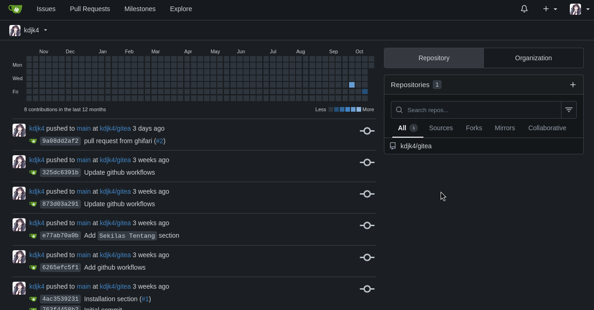

<p align="center"></p>

# Anggota Kelompok

- Taura Mohamad Inzaghi - G6401231019
- Naufal Ghifari Afdhala - G6401231029
- Berton Adiwidya Wibowo - G6401231043
- Muhammad Naufal Ramadhan - G6401231071
- Muhammad Salman Maulana - G6401231153

# Gitea

<!--toc:start-->

- [Anggota Kelompok](#anggota-kelompok)
- [Gitea](#gitea)
  - [Sekilas Tentang](#sekilas-tentang)
  - [Instalasi](#instalasi)
  - [Konfigurasi](#konfigurasi)
  - [Maintenance](#maintenance)
  - [Cara Pemakaian](#cara-pemakaian)
  - [Pembahasan](#pembahasan)
  - [Referensi](#referensi)
  <!--toc:end-->

## Sekilas Tentang

Gitea adalah sebuah platform pengembangan perangkat lunak lengkap (all-in-one) yang bersifat open-source dan dapat di-hosting secara mandiri (self-hosted). Fungsi utamanya adalah menyediakan layanan Git untuk kontrol versi (version control), yang dilengkapi dengan berbagai fitur pendukung kolaborasi tim, seperti pelacakan isu (issue tracking), ulasan kode (code review) melalui pull request, wiki untuk dokumentasi, hingga registri paket (package registry). Secara konsep dan antarmuka, Gitea sangat mirip dengan platform populer seperti GitHub dan GitLab, namun dengan fokus utama pada efisiensi, kecepatan, dan kemudahan instalasi.

Proyek Gitea lahir pada tahun 2016 sebagai sebuah fork (pengembangan cabang) dari proyek Gogs, dengan tujuan untuk membangun model pengembangan yang lebih terbuka dan digerakkan oleh komunitas. Ditulis menggunakan bahasa pemrograman Go, Gitea dapat dijalankan sebagai sebuah binary tunggal di berbagai sistem operasi (Linux, macOS, Windows) dan arsitektur prosesor (x86, amd64, ARM). Hal ini membuatnya sangat portabel dan tidak memiliki banyak dependensi eksternal, yang menyederhanakan proses instalasi dan pemeliharaan secara signifikan.

Salah satu filosofi desain utama Gitea adalah ringan dan cepat (lightweight and fast). Kebutuhan sumber daya sistemnya sangat rendah, di mana untuk tim atau proyek skala kecil, Gitea dapat berjalan dengan lancar hanya dengan 2 core CPU dan 1GB RAM. Bahkan, Gitea cukup efisien untuk dijalankan pada perangkat sekelas Raspberry Pi. Efisiensi ini menjadi keunggulan kompetitif utamanya dibandingkan solusi lain yang lebih kompleks dan haus sumber daya seperti GitLab.

### Tujuan Proyek

Pemilihan Gitea sebagai aplikasi web untuk proyek mata kuliah KDJK ini didasari oleh beberapa pertimbangan, yaitu dengan kebutuhan tim pengembangan skala kecil. Tujuan utama projek ini untuk membangun infrastruktur version control yang lebih private, cepat, dan dikelola kelompok kami.

Berikut adalah alasan kami memilih Gitea:

1. **Data Sovereignty**,

   Dalam lingkungan pengembangan, biasanya untuk proyek tahap awal, menyimpan kode di server pribadi memberikan lapisan keamanan dan privasi tambahan. Dengan self-hosting Gitea, kami memiliki kebebasan untuk mengatur data repositori, bebas dari potensi keterbatasan layanan pihak ketiga. Konsep ini sesuai dengan materi jaringan di mana kita membangun dan mengelola server kita sendiri.

2. **Efisiensi Resource dan Cost**,

   Pada proyek studi ini, kami bekerja dengan sumber daya yang terbatas. Gitea, dengan sifatnya yang light, memungkinkan kami untuk menginstallnya pada Virtual Private Server (VPS) dengan spesifikasi yag rendah tanpa mengorbankan performa. Hal ini mengurangi biaya operasional dibandingkan jika kami harus menyewa server untuk menjalankan pilihan seperti GitLab. Sehingga menunjukkan bahwa jaringan yang reliable tidak selalu membutuhkan infrastruktur yang mahal.

3. **Kemudahan Instalasi**,

   Proses instalasi Gitea yang dipermudah dengan Docker membuat kami bisa menyiapkan server dalam waktu singkat. Fokus utama kami adalah pada pemahaman konsep jaringan dan layanan, bukan pada kerumitan administrasi sistemnya. Kami dapat langsung fokus pada konfigurasi jaringan seperti reverse proxy dengan Nginx dan manajemen layanan.

4. **Suplemen untuk Belajar Layer Aplikasi**,

   Mengelola Gitea memberikan pengalaman bagi kami dalam administrasi layanan jaringan dari Layer Aplikasi pada model OSI/TCP-IP. Kami menjadi administrator yang bertanggung jawab atas uptime, keamanan, dan pemeliharaan server, tidak sebagai pengguna saja. Pengalaman memberikan pembelajaran yan gsesuai dengan materi-materi yang sudah dibahas di kelas, seperti pada materi Applications and Layered Architectures, pertemuan kedua, di mana Gitea berperan sebagai Application Layer Service.


## Instalasi

### Sistem Operasi

- Ubuntu Server 24.04

### Proses Instalasi

1. Update sistem dengan menjalankan perintah di bawah ini.

```bash
sudo apt-get update && sudo apt-get upgrade
```

2. Instal Docker.

```bash
# Tambahkan GPG Key Docker Official
sudo install -m 0755 -d /etc/apt/keyrings
sudo curl -fsSL https://download.docker.com/linux/ubuntu/gpg -o /etc/apt/keyrings/docker.asc
sudo chmod a+r /etc/apt/keyrings/docker.asc

# Tambahkan repository Docker ke dalam source list Apt
echo \
  "deb [arch=$(dpkg --print-architecture) signed-by=/etc/apt/keyrings/docker.asc] https://download.docker.com/linux/ubuntu \
  $(. /etc/os-release && echo "${UBUNTU_CODENAME:-$VERSION_CODENAME}") stable" | \
  sudo tee /etc/apt/sources.list.d/docker.list > /dev/null
sudo apt-get update

# Instal paket Docker
sudo apt-get install docker-ce docker-ce-cli containerd.io docker-buildx-plugin docker-compose-plugin

# Aktifkan service docker
sudo systemctl enable --now docker.service
```

3. Instal Gitea dengan menggunakan Docker Compose.

Buat direktori baru di home dan buat docker compose di dalamnya.

```bash
mkdir -p $HOME/gitea && cd $HOME/gitea

# Bisa juga menggunakan text-editor selain nano (contoh vi)
nano docker-compose.yaml
```

Tempelkan konten `docker-compose.yaml` di bawah ini ke dalamnya.

```yaml
networks:
  gitea:
    external: false
volumes:
  gitea_data:
    driver: local
  postgres_data:
    driver: local
services:
  server:
    image: docker.gitea.com/gitea:1.24.6
    container_name: gitea
    restart: always
    networks:
      - gitea
    volumes:
      - gitea_data:/gitea
      - /etc/timezone:/etc/timezone:ro
      - /etc/localtime:/etc/localtime:ro
    environment:
      - GITEA__database__DB_TYPE=postgres
      - GITEA__database__HOST=db:5432
      - GITEA__database__NAME=${DB_NAME:-gitea}
      - GITEA__database__USER=${DB_USER:-gitea}
      - GITEA__database__PASSWORD=${DB_PASS:-gitea}
    ports:
      - "127.0.0.1:3000:3000"
    depends_on:
      - db
  db:
    image: postgres:17
    restart: always
    container_name: gitea-db
    environment:
      - POSTGRES_USER=${DB_USER:-gitea}
      - POSTGRES_PASSWORD=${DB_PASS:-gitea}
      - POSTGRES_DB=${DB_NAME:-gitea}
    networks:
      - gitea
    volumes:
      - postgres_data:/var/lib/postgresql/data
```

Simpan file dengan menekan tombol `CTRL+O` lalu `ENTER` dan keluar dari nano dengan menekan tombol `CTRL+X`.

> Secara default pengaturan **database** adalah sebagai berikut.
>
> - **Username**: gitea
> - **Password**: gitea
> - **Nama Database**: gitea
>
> Namun, ini bisa diganti dengan cara langsung mengganti value di `docker-compose.yaml` atau dengan menambahkan **shell environment variables**.
>
> ```bash
> export DB_USER=username_database
> export DB_PASS=password_database
> export DB_NAME=nama_database
> ```

Selanjutnya jalankan container dengan perintah berikut.

```bash
sudo docker compose up -d
```

4. Instal dan konfigurasi Nginx Web Server.

Instal nginx menggunakan apt.

```bash
sudo apt-get install nginx
```

Selanjutnya buat konfigurasi nginx baru.

```bash
sudo nano /etc/nginx/conf.d/gitea.conf
```

Tempel konten `/etc/nginx/conf.d/gitea.conf` di bawah ini.

```nginx
server {
    listen 80;

    server_name localhost 127.0.0.1;

    client_max_body_size 512M;

    location / {
        proxy_pass http://127.0.0.1:3000;

        proxy_set_header Host $host;
        proxy_set_header X-Real-IP $remote_addr;
        proxy_set_header X-Forwarded-For $proxy_add_x_forwarded_for;
        proxy_set_header X-Forwarded-Proto $scheme;
    }
}
```

> Note: `server_name localhost 127.0.0.1` bisa diganti jika memiliki nama domain (contoh `server_name gitea-lab.ddns.net`).

Lalu reload service nginx.

```bash
sudo systemctl reload nginx
```

5. Mengaktifkan HTTPS dengan sertifikat SSL/TLS (opsional).

Langkah ini bersifat opsional. Jika kita memiliki sertifikat SSL/TLS (misal dari [Let's Encrypt](https://letsencrypt.org)), HTTPS bisa diaktifkan pada situs Gitea ini.

Instal certbot.

```bash
sudo apt-get install certbot python3-certbot-nginx
```

Lalu jalankan perintah.

```bash
sudo certbot --nginx -d gitea-lab.ddns.net
```

> Note: ganti `gitea-lab.ddns.net` dengan nama domain yang didaftarkan di [Let's Encrypt](https://letsencrypt.org).

## Konfigurasi

### Konfigurasi Awal

Setelah selesai melakukan instalasi dan pergi ke alamat domain Gitea, halaman pertama yang akan disuguhkan adalah `Initial Configuration`,
yang di dalamnya terdapat 3 bagian pengaturan, yaitu: `Database Settings`, `General Settings`, dan `Optional Settings`. Semua konfigurasi yang dilakukan di sini nantinya akan ditulis ke dalam file konfigurasi Gitea yang terletak di `/data/gitea/conf/app.ini` yang ada di dalam container Gitea.


1. **Database Settings**

Pada **database settings** ada 7 kolom yang harus diisi, di mana 5 dari 7 kolom sudah terisi. Kita tinggal mengisi konfigurasi ini sesuai dengan apa yang telah didefinisikan di **environment variable** maupun `docker-compose.yaml` atau bisa tinggal dibiarkan kosong karena Gitea otomatis mengambil konfigurasi dari **environment variable** yang telah didefinisikan.


2. **General Settings**

Selanjutnya adalah **general settings**, di mana kebanyakan kolom pengaturan yang ada di sini bisa kita biarkan default saja.

Kolom yang mungkin perlu diberi perhatian adalah:

- **Site Title**: nama kustom untuk **self-hosted** Gitea kita.
- **Git LFS Root Path**: Git pada dasarnya hanya efisien untuk file teks dan tidak efisien untuk file besar seperti gambar, video, audio, atau binary. Nah _Git LFS_ adalah ekstensi Git untuk menyiasati hal ini. **Path** di sini adalah lokasi di filesystem tempat Gitea menyimpan file-file besar milik repository yang memakai Git LFS. Bisa dikosongkan kalau tidak mau mengaktifkan Git LFS.
- **SSH Server Port**: bisa dikosongkan apabila tidak ingin mengaktifkan Gitea SSH Server.


3. **Optional Settings**

Berisi konfigurasi-konfiguras opsional, termasuk: konfigurasi SMTP untuk mengaktifkan email support pada Gitea, lalu konfigurasi server dan pihak ketiga, dan yang terakhir adalah akun administrator.


> Note: jika akun administrator tidak dibuat di sini, maka akun pertama yang terdaftar di Gitea nantinya akan secara otomatis menjadi administrator.

### Konfigurasi Lanjutan

Untuk konfigurasi lanjutan bisa dibuka dengan cara masuk dengan akun administrator dan pergi ke halaman `Site Administration`.
Atau opsi konfigurasi lainnya bisa dengan mengedit langsung file konfigurasi `app.ini` (tersimpan di `/data/gitea/conf`) di dalam container Gitea (atau dengan akses langsung ke file volume container).
Untuk opsi konfigurasi pada `app.ini` bisa dilihat pada [Gitea Configuration Cheat Sheet](https://docs.gitea.com/administration/config-cheat-sheet).


## Maintenance

### Gitea Internal Maintenance

Gitea secara nyaman sudah memberikan fasilitas pemeliharaan yang sangat mudah. Untuk dasbor pemeliharaan sendiri terdapat pada `Site Administration`, di dasbor pemeliharaan ini kita bisa menjalankan berbagai aksi untuk memelihara aplikasi, contohnya seperti: menghapus semua akun yang tidak teraktivasi, menjalankan pengecekan kesehatan untuk semua repository, dan lain-lain.


Gitea juga telah dilengkapi dengan sistem _internal scheduler_ yang secara otomatis menjalankan berbagai tugas pemeliharaan tanpa perlu konfigurasi tambahan. Tugas-tugas ini dijalankan melalui _background cron jobs_ yang terintegrasi langsung ke dalam Gitea.

Beberapa tugas pemeliharaan penting yang dijalankan otomatis oleh Gitea antara lain: update mirrors setiap 10 menit, cek kesehatan repositori setiap tengah malam, dan lain-lain.

Ada juga tugas tambahan yang bisa diaktifkan sesuai kebutuhan seperti: garbage collection untuk objek LFS, garbage collection untuk semua repositori dan lain-lain.


### Backup Gitea

Gitea memiliki perintah `dump` yang akan menyimpan instalasi Gitea ke dalam file `zip`. Yang nantinya file ini bisa di extract dan dipakai untuk me-restore suatu instance.

Untuk melakukan backup kita tinggal menjalankan perintah:

```bash
sudo docker exec -u git -it -w /tmp $(docker ps -qf 'name=gitea$') bash -c '/usr/local/bin/gitea dump -c /data/gitea/conf/app.ini --file /tmp/gitea-dump.zip'
```

Keterangan:

- `-u git`: jalankan perintah dengan user `git`.
- '$(docker ps -qf 'name=gitea$')`: mengambil container id untuk container dengan nama `gitea`(perhatikan bahwa $ di sini artinya akhir dari sebuah string, jika tidak pakai itu bisa saja container`gitea-db` akan terambil juga karena value name adalah sebuah pattern).
- `bash -c '/usr/local/bin/gitea dump ... --file /tmp/gitea-dump.zip': menjalankan interactive bash dengan perintah `gitea dump`.

Perintah di atas akan membuat backup dengan nama `gitea-dump.zip` di dalam direktori `/tmp` di container. Selanjutnya kita perlu menyalin backup tersebut ke sistem host dan menghapus yang ada di dalam container setelahnya.

```bash
sudo docker cp $(docker ps -qf 'name=gitea$'):/tmp/gitea-dump.zip /tmp/gitea-dump.zip
sudo docker exec -u git -it -w /tmp $(docker ps -qf 'name=gitea$') bash -c 'rm /tmp/gitea-dump.zip'
```

Perintah pertama akan memindahkan file `gitea-dump.zip` ke `/tmp/gitea-dump.zip` ke filesystem host, dan perintah kedua menghapus `/tmp/gitea-dump.zip` yang ada di dalam container untuk memastikan volume container tetap ringan.

## Cara Pemakaian

Setelah Gitea berhasil diinstal dan dikonfigurasi, platform ini siap digunakan untuk menunjang alur kerja pengembangan perangkat lunak tim. Bagian ini akan menjelaskan fungsi-fungsi utama Gitea beserta alur kerja yang direkomendasikan untuk tim kecil, berdasarkan praktik terbaik di industri.

### Tampilan Aplikasi

Antarmuka Gitea dirancang agar bersih, cepat, dan intuitif, dengan kemiripan yang kuat dengan platform populer seperti GitHub, sehingga memudahkan proses adaptasi bagi pengguna baru.

- **Halaman Awal & Registrasi:** Pengguna baru akan disambut oleh halaman utama yang menjelaskan fitur-fitur Gitea. Proses registrasi akun sangat sederhana dan hanya memerlukan informasi dasar.


- **Dashboard Pengguna:** Setelah login, pengguna akan melihat Dashboard personal. Halaman ini berfungsi sebagai pusat kendali yang menampilkan *feed* aktivitas dari repositori yang diikuti, serta daftar semua repositori yang dapat diakses oleh pengguna.




### Fungsi-Fungsi Utama

Berikut adalah beberapa fungsi esensial Gitea yang menjadi inti dari alur kerja kolaboratif.

#### 1. Manajemen Repositori (Code Hosting)

Setiap proyek dimulai dengan sebuah repositori. Pengguna dapat membuat repositori baru atau melakukan *fork* dari repositori yang sudah ada. Halaman utama repositori menjadi pusat dari semua aktivitas, menampilkan daftar file dan direktori, riwayat *commit*, serta navigasi ke fitur-fitur lainnya.


#### 2. Manajemen Proyek (Issues & Kanban Boards)

Gitea menyediakan dua alat utama untuk manajemen proyek:

- **Issues:** Berfungsi sebagai pusat pelacakan tugas, laporan *bug*, dan permintaan fitur. Setiap *issue* dapat diberi label, ditugaskan ke anggota tim, dan dikelompokkan dalam *milestones*.


- **Projects (Kanban Boards):** Untuk memvisualisasikan alur kerja, Gitea menyediakan papan Kanban. Tim dapat membuat kolom-kolom seperti "To Do", "In Progress", dan "Done", lalu memindahkan kartu (*issue*) sesuai dengan progres pengerjaannya.


#### 3. Kolaborasi Kode (Pull Requests)

*Pull Requests* (PR) adalah jantung dari kolaborasi kode. Fitur ini memungkinkan seorang developer untuk mengusulkan perubahan kode dari sebuah *branch* ke *branch* lainnya (biasanya ke `main`). Di dalam PR, tim dapat melakukan diskusi dan *review* kode baris per baris sebelum perubahan tersebut digabungkan, memastikan kualitas kode tetap terjaga.


### Interaksi Pengguna (Alur Kerja Tim)

Berdasarkan hasil riset mengenai praktik terbaik untuk tim kecil, kami mengadopsi alur kerja yang sederhana namun efektif yang disebut **GitHub Flow**. Alur ini memastikan bahwa *branch* utama (`main`) selalu dalam keadaan stabil dan siap untuk di-*deploy*.

Berikut adalah langkah-langkah interaksi pengguna dalam satu siklus pengembangan fitur di Gitea:

1.  **Ambil Tugas dari *Issue Tracker***: Seorang developer membuka halaman **Issues** dan mengambil satu tugas yang akan dikerjakan.
2.  **Buat *Feature Branch***: Dari halaman repositori, developer membuat *branch* baru dari `main` dengan nama yang deskriptif, misalnya `feature/user-login`.
3.  **Lakukan Perubahan (Coding & Commit)**: Developer menulis kode di lingkungan lokalnya, melakukan `commit` secara berkala, dan melakukan `push` ke *feature branch* yang baru dibuat di server Gitea.
4.  **Buka *Pull Request***: Setelah fitur selesai, developer membuka **Pull Request** yang ditujukan ke *branch* `main`. Dalam deskripsi PR, ia akan menautkan *issue* yang relevan (misal: "Closes #12") agar Gitea dapat menutup *issue* tersebut secara otomatis saat PR digabungkan.
5.  ***Code Review***: Anggota tim lain mendapatkan notifikasi, membuka PR, lalu memberikan komentar dan masukan langsung pada baris-baris kode yang berubah.
6.  **Merge & Hapus Branch**: Setelah disetujui, PR digabungkan (*merge*) ke dalam *branch* `main`. *Feature branch* yang sudah tidak terpakai kemudian dihapus untuk menjaga kebersihan repositori.

Alur kerja ini, yang sepenuhnya didukung oleh fitur-fitur Gitea, memastikan setiap perubahan tercatat, terverifikasi, dan menjaga kolaborasi tim tetap terorganisir dan efisien.

## Pembahasan

Bagian ini menyajikan analisis mendalam mengenai aplikasi Gitea berdasarkan pengalaman langsung selama proses instalasi, konfigurasi, dan penggunaan, yang diperkaya dengan data dari studi kasus dan riset akademis. Pembahasan akan mencakup evaluasi kelebihan dan kekurangan Gitea secara kritis, serta perbandingan komparatif dengan platform sejenis untuk memberikan konteks yang lebih luas.

### Kelebihan Gitea (Berdasarkan Pengalaman dan Analisis)

#### 1. Ringan dan Cepat

Salah satu keunggulan utama yang kami rasakan secara langsung adalah performa Gitea yang sangat responsif dengan kebutuhan sumber daya yang sedikit. Gitea menunjukkan konsumsi CPU dan memori yang jauh lebih rendah dibandingkan dengan platform DevOps lengkap seperti GitLab. Gitea yang ditulis dalam bahasa Go, yang menghasilkan _single binary_ dengan dependensi minimal.

Dalam konteks proyek kami yang menggunakan VPS dengan sumber daya terbatas, Gitea dapat berjalan dengan lancar tanpa menyebabkan _bottleneck_ pada sistem. Gitea sangat menguntungkan bagi organisasi dengan infrastruktur terbatas di mana efisiensi biaya dan alokasi sumber daya menjadi faktor pentingnya.

#### 2. Full Control dan Data Sovereignty

Dengan meng-hosting Gitea pada server pribadi, kami memiliki kontrol penuh atas kode sumber dan data proyek. Keunggulan ini tidak didapatkan dari layanan berbasis _cloud public_. Semua data, mulai dari repositori, isu, hingga data pengguna, tersimpan di dalam infrastruktur yang kami kelola, di belakang _firewall_ kami. Hal ini mengurangi risiko yang terkait dengan kebijakan privasi pihak ketiga, potensi kebocoran data, atau pemadaman layanan yang berada di luar kendali kami.

Penggunaan Docker dalam instalasi Gitea juga menambahkan lapisan keamanan melalui isolasi. Kontainer Gitea berjalan dalam lingkungan yang terpisah dari sistem operasi _host_, yang membatasi potensi kerusakan jika terjadi celah keamanan pada aplikasi. Meskipun kontainerisasi memperkenalkan tantangan keamanan tersendiri, seperti risiko dari _image_ yang rentan atau miskonfigurasi jaringan, arsitektur _shared kernel_ pada dasarnya dapat memicu kebocoran informasi jika tidak dikelola dengan benar (Gao et al., 2021). Namun, dengan mengikuti best practice, seperti menggunakan _official image_, tidak menjalankan kontainer sebagai _root_, dan mengelola _secrets_ dengan benar, manfaat isolasi jauh lebih besar daripada risikonya untuk skala proyek kami.

#### 3. Instalasi dan Manajemen yang Disederhanakan 🛠️

Proses instalasi menggunakan Docker dan Docker Compose sangat efisien. Dengan hanya satu file `docker-compose.yaml`, kami dapat mendefinisikan dan menjalankan seluruh layanan Gitea beserta databasenya. Ini menyederhanakan proses yang biasanya bisa memakan waktu berjam-jam, seperti menginstal dependensi, mengkonfigurasi database, dan mengatur pengguna sistem secara manual.

Dengan menggunakan Docker pada Gitea, meskipun ada sedikit _overhead_ pada performa I/O disk, manfaat dalam hal manajemen, portability, dan kemudahan _update_ jauh lebih besar manfaatnya. Proses pembaruan Gitea menjadi sesederhana menarik _image_ Docker versi terbaru dan menjalankan ulang kontainer, proses yang lebih bersih dan tidak rentan kesalahan dibandingkan pembaruan pada instalasi _native_.

#### 4. Antarmuka Familiar dan Intuitif 👨‍💻

Antarmuka pengguna Gitea dibuat sangat mirip dengan GitHub. Bagi anggota tim kami yang sudah terbiasa dengan GitHub, transisi ke Gitea hampir tidak memerlukan learnig curve yang sulit. Tata letak untuk repositori, _pull request_, _issues_, dan pengaturan organisasi terasa sangat intuitif. Kemiripan ini mempercepat adopsi dan membuat tim dapat menggunakannya tanpa perlu pelatihan khusus terlebih dahulu. Faktor ini penting bagi tim kecil yang mengutamakan kecepatan dan agility dalam alur kerja pengembangan mereka.


### Kekurangan Gitea (Berdasarkan Pengalaman dan Analisis)

Meskipun Gitea menawarkan banyak keunggulan, kami mengakui adanya _trade-off_. Filosofi desainnya yang ringan dan minimalis membawa beberapa keterbatasan jika dibandingkan dengan platform yang lebih besar.

#### 1. Beban Administratif dan Tanggung Jawab Keamanan Penuh

Kebebasan dan kontrol penuh dari model _self-hosting_ harus diikuti dnengan tanggung jawab yang besar. Dengan mengelola Gitea sendiri, tim kami juga berperan sebagai administrator sistem. Tanggung jawab ini mencakup seluruh siklus hidup pemeliharaan server, yang merupakan pekerjaan teknis yang terus menerus dan tidak bisa diabaikan.

- **Pemeliharaan Rutin:** Kami bertanggung jawab untuk melakukan pembaruan Gitea secara berkala, mem-patch sistem operasi, dan memastikan semua komponen (seperti Nginx dan Docker) tetap aman dan update.
- **Keamanan:** Gitea, seperti perangkat lunak lainnya, tidak luput dari penemuan celah keamanan (vulnerabilities). Pada tahun 2024-2025 saja, beberapa celah keamanan telah ditemukan, mulai dari _Cross-Site Scripting_ (XSS) hingga isu pada implementasi SSH. Tanggung jawab untuk memantau pengumuman keamanan dan segera menerapkan _patch_ berada di tangan kami sebagai administrator. Kelalaian dalam hal ini dapat membuka server terhadap risiko eksploitasi.
- **Strategi Backup dan Pemulihan:** Data adalah aset paling berharga. Kami harus merancang dan mengimplementasikan strategi _backup_ yang reliable. Praktik terbaik untuk Gitea mengharuskan layanan dihentikan sementara saat proses _backup_ untuk menjamin konsistensi data antara database dan repositori. Proses pemulihan (_restore_) juga merupakan prosedur yang rumit. Beban operasional ini ada pada layanan SaaS seperti GitHub atau GitLab.com, ditangani oleh penyedia layanan.

Beban ini seringkali ditanggung Usaha Kecil dan Menengah (UKM), yang biasanya memiliki sumber daya dan keahlian IT yang terbatas. Tantangan dalam mengelola skalabilitas dan sumber daya aplikasi pada infrastruktur _on-premises_ dapat menjadi penghalang yang besar (Tonge et al., 2025).

#### 2. Keterbatasan Fitur Lanjutan dan Ekosistem

Fokus Gitea pada efisiensi berarti Gitea tidak menawarkan rangkaian fitur DevOps terintegrasi selengkap GitLab. Bagi tim yang membutuhkan alur kerja DevOps yang canggih, ini bisa menjadi sebuah kekurangan.

- **CI/CD yang Lebih Sederhana:** Meskipun Gitea Actions dirancang agar kompatibel dengan GitHub Actions, terdapat beberapa keterbatasan teknis. Beberapa sintaks _workflow_ penting seperti `concurrency` (untuk mengontrol eksekusi _job_ secara bersamaan) dan `permissions` (untuk mengatur hak akses granular pada level _job_) belum didukung. Bagi tim yang sangat bergantung pada otomatisasi CI/CD yang kompleks, keterbatasan ini mungkin menjadi penghalang.
- **Fitur Enterprise Terbatas:** GitLab menawarkan fitur-fitur bawaan yang ditujukan untuk perusahaan besar, seperti _security scanning_ (SAST, DAST), _compliance management_, dan _value stream analytics_. Fitur-fitur ini tidak ada di Gitea. Untuk mendapatkan fungsionalitas serupa, tim harus mengintegrasikan dan mengelola perangkat lunak pihak ketiga secara manual, yang menambah kompleksitas pada _tech stack_.
- **Ekosistem Plugin yang Masih Berkembang:** Ekosistem integrasi Gitea cukup matang untuk kebutuhan inti dan digerakkan oleh komunitas yang aktif. Namun, jumlahnya tidak sebanyak dan tidak seketat "marketplace" pada GitHub atau GitLab. Jika tim Anda bergantung pada integrasi yang sangat spesifik dengan perangkat lunak enterprise lain, kemungkinan besar Anda akan menemukan dukungan _out-of-the-box_ yang lebih baik pada platform yang lebih besar.

Singkatnya, kekurangan Gitea disebabkan karena Gitea menempatkan lebih banyak tanggung jawab pada pengguna sebagai ganti dari kontrol dan efisiensi, serta fokus pada fitur inti _version control_ daripada menyediakan platform DevOps yang serba ada.


### Perbandingan dengan Aplikasi Sejenis

Untuk memahami posisi Gitea dalam ekosistem _version control_, penting untuk membandingkannya dengan platform lain yang populer di kategori yang sama. Perbandingan ini akan difokuskan pada dua platform utama: GitLab, sebagai kompetitor kelas berat dengan fitur lengkap, dan Gogs, sebagai proyek asal-usul Gitea.

#### Gitea vs. GitLab

Gitea dan GitLab seringkali dianggap sebagai pilihan utama untuk _self-hosted Git service_, namun keduanya melayani segmen pengguna yang sangat berbeda dan dibangun di atas filosofi yang berlawanan. Gitea mengutamakan kesederhanaan, kecepatan, dan efisiensi, sementara GitLab bertujuan untuk menjadi platform DevOps terintegrasi yang mencakup seluruh siklus hidup pengembangan perangkat lunak. Perbedaan mendasar ini terlihat dalam setiap aspek, mulai dari kebutuhan sumber daya hingga model pengembangannya.

Analisis perbandingan menunjukkan bahwa model pengembangan yang digerakkan oleh komunitas seperti Gitea cenderung berfokus pada kebutuhan teknis inti dan keberlanjutan jangka panjang yang didorong oleh kontributor, sedangkan proyek yang didukung korporasi seperti GitLab memiliki roadmap yang lebih terstruktur dan berorientasi pada fitur komersial. Tata kelola partisipatif dalam komunitas _open-source_ sering kali menghasilkan evolusi fitur yang lebih baik dan sesuai dengan kebutuhan pengguna aktif (Alami et al., 2022).

Berikut adalah tabel perbandingan ringkas antara keduanya:

| Aspek Perbandingan        | Gitea                                                                                                                                         | GitLab                                                                                                                                        |
| :------------------------ | :-------------------------------------------------------------------------------------------------------------------------------------------- | :-------------------------------------------------------------------------------------------------------------------------------------------- |
| **Filosofi & Target**     | **Ringan & Cepat.** Ditujukan untuk individu, tim kecil, hingga UKM yang membutuhkan _version control_ yang efisien dan mudah dikelola.       | **Platform DevOps Lengkap.** Ditujukan untuk tim menengah hingga korporasi besar yang membutuhkan solusi _end-to-end_ terintegrasi.           |
| **Kebutuhan Sumber Daya** | **Sangat Rendah.** Dapat berjalan lancar dengan 1-2 core CPU dan 1GB RAM. Ideal untuk VPS atau server dengan spesifikasi rendah.              | **Tinggi.** Membutuhkan minimal 4 core CPU dan 4GB RAM (8GB direkomendasikan) bahkan untuk instalasi skala kecil.                             |
| **Fitur CI/CD**           | **Gitea Actions.** Kompatibel dengan sintaks GitHub Actions, namun beberapa fitur lanjutan seperti `concurrency` belum didukung.              | **GitLab CI/CD.** Sangat matang, kaya fitur, dan terintegrasi secara mendalam. Dianggap sebagai salah satu yang terbaik di industri.          |
| **Ekosistem & Fitur**     | **Fokus pada Inti.** Menyediakan fitur-fitur esensial (Git, Issues, PR, Wiki, Package Registry). Integrasi lain bergantung pada pihak ketiga. | **Semua Ada (All-in-One).** Menyediakan fitur bawaan untuk _security scanning_ (SAST/DAST), _monitoring_, _planning boards_, dan banyak lagi. |
| **Model Pengembangan**    | **Digerakkan Komunitas.** Sepenuhnya _open-source_ dan dikembangkan oleh kontributor global. Peta jalan lebih fleksibel dan transparan.       | **Didukung Korporasi.** Model "Open Core", di mana edisi komunitas gratis, namun fitur-fitur canggih hanya tersedia di versi berbayar.        |
| **Kompleksitas**          | **Sederhana.** Instalasi dan pemeliharaan sangat mudah, terutama dengan Docker.                                                               | **Kompleks.** Instalasi dan pemeliharaan lebih rumit karena terdiri dari banyak komponen yang saling bergerak.                                |

Pilihlah **Gitea** jika prioritas kita adalah performa, efisiensi sumber daya, kontrol penuh, dan kesederhanaan untuk kebutuhan _version control_ inti. Pilih **GitLab** jika kita membutuhkan platform DevOps terintegrasi yang kuat dengan fitur-fitur enterprise dan bersedia mengalokasikan sumber daya server yang lebih besar.

#### Gitea vs. Gogs

Perbandingan antara Gitea dan Gogs menark karena Gitea merupakan _fork_ dari Gogs. Gitea dibuat pada tahun 2016 oleh sekelompok kontributor Gogs yang menginginkan model pengembangan yang lebih cepat dan lebih terbuka yang digerakkan oleh komunitas. Sejak saat itu, Gitea telah berevolusi besar besaran, sementara Gogs tetap setia pada filosofi minimalisnya di bawah pengelolaan satu pengembang utama.

- **Pengembangan dan Komunitas:** Perbedaan paling terlihat adalah laju pengembangan. Gitea memiliki komunitas yang jauh lebih besar dan aktif, yang menghasilkan rilis fitur baru, perbaikan bug, dan _patch_ keamanan yang lebih sering. Sebaliknya, pengembangan Gogs lebih lambat dan lebih terukur. Hasil riset kepuasan komunitas menunjukkan Gitea memiliki peta roadmap yang lebih menjanjikan.
- **Kelengkapan Fitur:** Gitea telah menambahkan banyak fitur yang tidak ada di Gogs, yang paling terlihat adalah **Gitea Actions** (sistem CI/CD terintegrasi) dan **Package Registry**. Fitur-fitur ini menjadikan Gitea sebagai solusi yang lebih mendekati platform DevOps ringan, sementara Gogs tetap fokus murni sebagai layanan hosting Git yang sangat minimalis.
- **Filosofi:** Gogs unggul dalam satu hal, yaitu minimalisme. Gogs membutuhkan sumber daya yang bahkan lebih rendah daripada Gitea dan merupakan pilihan terbaik jika kebutuhan kita hanyalah layanan Git dasar yang paling ringan dan sederhana.

Pilihlah **Gogs** jika kita membutuhkan solusi paling minimalis dan ringan yang hanya untuk _hosting_ Git. Untuk hampir semua kasus penggunaan lainnya, **Gitea** adalah pilihan yang lebih baik karena pengembangan aktif, komunitas yang mendukung, dan set fitur yang jauh lebih banyak tanpa mengorbankan efisiensi yang tinggi.

## Referensi

- Tonge, A. S., Baniya, B. K., & GC, D. (2025). Efficient, scalable, and secure network monitoring platform: self-contained solution for future smes. Network, 5(3), 36. https://doi.org/10.3390/network5030036
- Gao, X., Steenkamer, B. P., Gu, Z., Kayaalp, M., Pendarakis, D., & Wang, H. (2021). A study on the security implications of information leakages in container clouds. IEEE Transactions on Dependable and Secure Computing, 18(1), 174-191. https://doi.org/10.1109/tdsc.2018.2879605
- Alami, A., Pardo, R., Cohn, M. L., & Wąsowski, A. (2022). Pull request governance in open source communities. IEEE Transactions on Software Engineering, 48(12), 4838-4856. https://doi.org/10.1109/tse.2021.3128356
- Gitea Documentation - [https://docs.gitea.com/](https://docs.gitea.com/)
- Install Docker Engine on Ubuntu - [https://docs.docker.com/engine/install/ubuntu/](https://docs.docker.com/engine/install/ubuntu/)
- nginx documentation - [https://nginx.org/en/docs/](https://nginx.org/en/docs/)
